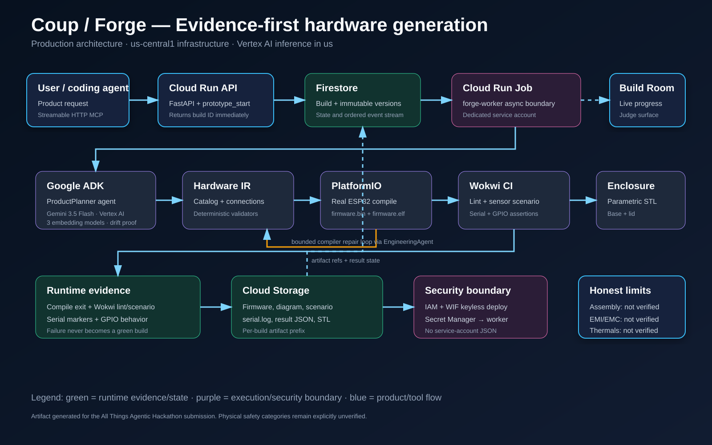

# COUP

**Infrastructure for agents that build hardware.**

COUP is an execution layer for coding agents working on supported low-voltage physical prototypes. An agent submits a product request through MCP, receives a Build Room URL immediately, and COUP plans, builds, simulates, packages, and records evidence for the resulting prototype.

## The problem

Software agents can edit code, run tests, and deploy services because those workflows expose machine-readable feedback. Hardware work spans component selection, wiring, firmware, simulation, and mechanical artifacts across separate tools. COUP connects those stages into one inspectable workflow without treating a plausible model response as verified hardware behavior.

## How it works

```text
Coding agent → MCP → COUP API → asynchronous worker
                                  ├─ plan and validate
                                  ├─ compile firmware
                                  ├─ simulate behavior
                                  ├─ generate enclosure artifacts
                                  └─ publish evidence to the Build Room
```

Each build is immutable. The API returns before the worker finishes, while the Build Room follows the Firestore-backed event stream and exposes generated artifacts.

## Capabilities

- MCP tools to start, update, inspect, and download a hardware build.
- Structured product specifications and deterministic electrical validation.
- Arduino firmware generation and real ESP32 compilation with PlatformIO.
- Behavioral validation in Wokwi when credentials are available.
- Parametric enclosure STL generation and downloadable evidence bundles.
- Explicit verification states: digital evidence never implies physical assembly, EMI/EMC, or thermal testing.

## Architecture



| Surface | Implementation | Responsibility |
| --- | --- | --- |
| Build Room | Next.js 16, React 19, Three.js | Realtime build state, artifact and evidence views |
| API + MCP | FastAPI, MCP Python SDK | Asynchronous `prototype_*` tools and artifact delivery |
| Agent workflow | Google ADK, Gemini 3.5 Flash | Planning and evidence-grounded repair proposals |
| Worker | Cloud Run Job-compatible Python process | Validation, PlatformIO, Wokwi, enclosure, reports |
| State | Firestore | Build source of truth and event stream |
| Artifacts | Cloud Storage or local filesystem | Firmware, simulation, STL, and verification outputs |

The API dispatches Cloud Run Jobs with a `BUILD_ID` override. Local development uses the same `BuildOrchestrator` through a background executor.

## Run locally

Prerequisites: Node.js 22+, Python 3.11–3.13, and Git. Docker is optional.

```powershell
npm install

py -3.13 -m venv .venv
.\.venv\Scripts\python.exe -m pip install -e 'services/build-worker[dev]'

py -3.13 -m venv .platformio-venv
.\.platformio-venv\Scripts\python.exe -m pip install platformio==6.1.19
```

Run the backend and web application in separate terminals:

```powershell
npm run backend:dev

npm run dev
```

The backend scripts automatically use the repository `.venv` and, when available, the local PlatformIO virtual environment. Open [http://localhost:3000](http://localhost:3000). To exercise the backend vertical slice, run `npm run smoke`. The first PlatformIO invocation downloads the ESP32 toolchain; later runs reuse the cache.

## Configuration

Start from [.env.example](.env.example). Backend secrets are deliberately not loaded from `.env`: use Application Default Credentials locally and Secret Manager in Cloud Run. For a Wokwi-backed smoke run, `scripts/with-gcp-secrets.ps1` injects the token only into its child process.

The public browser configuration uses `NEXT_PUBLIC_*` variables only. Never put a secret in one of them. See [docs/cloud-security.md](docs/cloud-security.md) for identity, secret, and deployment setup.

## Deploy

Terraform in [infra/](infra/README.md) provisions Cloud Run, Firestore, Cloud Storage, least-privilege identities, and the Wokwi secret reference. [cloudbuild.yaml](cloudbuild.yaml) deploys the API and worker; the Next.js app can be deployed to Vercel or the configured Cloud Run web service.

GitHub Actions uses OIDC and Workload Identity Federation, never a stored Google service-account key. [docs/deploy-performance.md](docs/deploy-performance.md) documents deployment routing and measured performance.

For integration and operational details, see [MCP setup](docs/mcp.md), the [product overview](docs/product-overview.md), [verification evidence](docs/verification-evidence.md), and the [product walkthrough](docs/product-walkthrough.md).

## Repository structure

```text
apps/web/                  Build Room frontend
services/build-worker/     API, MCP server, workflow, and tests
infra/                     Terraform infrastructure
docs/                      Product, architecture, operations, and integration docs
docs/history/              Preserved historical records
scripts/                   Local and operational helpers
```

## Roadmap

### Now

- Improve build reliability, queue visibility, and failure recovery.
- Strengthen observability, security controls, and verification evidence.
- Refine the Build Room experience and local developer workflow.

### Next

- Expand the supported low-voltage component catalog and validated prototype patterns.
- Improve iterative build updates and artifact comparison.
- Add more deterministic simulation scenarios for supported designs.

### Later

- Broaden platform integrations and collaborative workflows.
- Evaluate additional manufacturing and physical-test evidence paths.

## Contributing

Run the relevant checks before opening a change:

```powershell
npm run lint
npm run build
npm test
npm run backend:test
.\.venv\Scripts\python.exe -m ruff check services/build-worker/src services/build-worker/tests
```

## License

See [LICENSE](LICENSE).
