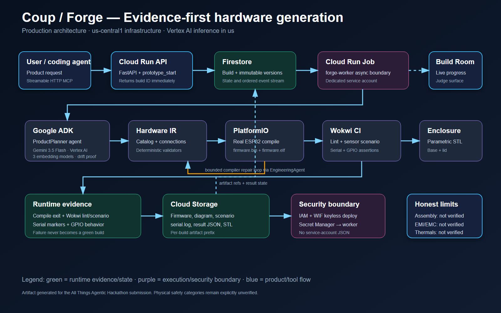

# AI agents can already build software. Now they can build physical products.

Forge Physical is agent-native infrastructure for building low-voltage electronic prototypes. A
coding agent calls one remote MCP tool, gets a Build Room URL immediately, and the backend takes over:

```text
Codex / Claude Code / Gemini CLI
                ↓  Streamable HTTP MCP
        Product intent + constraints
                ↓
   Google ADK + Gemini build workflow
                ↓
Hardware IR → electrical checks → firmware → PlatformIO → repair loop
                ↓                         ↓
        Wokwi scenario              parametric STL
                └──────────→ verification report
```

This is not a chatbot, EDA suite, CAD replacement, or simulated landing page. Every green state in the
Build Room comes from backend evidence. Missing credentials and physical tests remain visibly
`unavailable` or `not_verified`.

## The demo

Ask your coding agent:

> Create an ESP32 temperature alarm. Use a temperature sensor. Turn the warning LED on when temperature is above 30°C. The design must be testable automatically in Wokwi.

The production golden path selects an ESP32-S3 DevKitC-1, DHT22, LED, and current-limiting resistor, then:

1. creates a constrained `ProductSpec`;
2. generates the Hardware IR and runs nine deterministic electrical checks;
3. generates Arduino firmware and compiles it with PlatformIO;
4. gives compiler evidence to the ADK EngineeringAgent and retries a bounded repair loop;
5. generates a Wokwi scenario that drives 25°C then 35°C and asserts the LED state;
6. exports parametric base/lid STL files;
7. emits a verification report that distinguishes digital evidence from physical verification.

The production worker produces a real `firmware.bin`, real STL files, and structured Firestore
events. An absent or malformed Wokwi CI token remains honestly unavailable and cannot produce a
completed hardware-validation claim.

## Architecture



| Surface | Implementation | Responsibility |
| --- | --- | --- |
| Build Room | Next.js 16, React 19, Three.js | Realtime product canvas, build stages, evidence |
| API + MCP | FastAPI, MCP Python SDK | Async `prototype_*` tools and artifact delivery |
| Agent workflow | Google ADK, Gemini 3.5 Flash | Product planning and evidence-grounded repair proposals |
| Semantic alignment | Gemini Embedding, Text Embedding, Multilingual Embedding | Cross-model prompt-to-spec drift evidence |
| Worker | Cloud Run Job-compatible Python process | Validators, PlatformIO, Wokwi, enclosure, report |
| State | Firestore | Build source of truth and realtime event stream |
| Artifacts | Cloud Storage in Cloud; filesystem locally | Firmware, Wokwi config, STL, reports |

The API asks Cloud Run Jobs to execute a build using a `BUILD_ID` environment override. Local
development uses the same `BuildOrchestrator` in a background executor. The MCP request never waits
for the heavy workflow.

## Quickstart

Prerequisites: Node.js 22+, Python 3.11–3.13, and Git. Docker is optional. Backend secrets are not
loaded from `.env`; use ADC and the ephemeral Secret Manager helper described below.

```powershell
npm install

py -3.13 -m venv .venv
.\.venv\Scripts\python.exe -m pip install -e 'services/build-worker[dev]'

# PlatformIO stays isolated from the ADK dependency graph.
py -3.13 -m venv .platformio-venv
.\.platformio-venv\Scripts\python.exe -m pip install platformio==6.1.19
$env:PLATFORMIO_CMD=(Resolve-Path '.\.platformio-venv\Scripts\platformio.exe').Path
```

Run the services in separate terminals:

```powershell
# Backend terminal
. .\.venv\Scripts\Activate.ps1
npm run backend:dev

# Web terminal
npm run dev
```

Open [http://localhost:3000](http://localhost:3000), or prove the backend vertical slice directly:

```powershell
$env:PLATFORMIO_CMD=(Resolve-Path '.\.platformio-venv\Scripts\platformio.exe').Path
npm run smoke
```

The first PlatformIO run downloads the ESP32 toolchain. Later builds reuse its cache.

For Google Cloud access locally, run `gcloud auth application-default login`. When Wokwi is needed,
`.\scripts\with-gcp-secrets.ps1 -Command npm -CommandArgs @('run','smoke')` fetches the token from
Secret Manager only for that child process and never writes it to disk.

## MCP tools

Only four tools are exposed:

- `prototype_start(prompt)` — queues a build and immediately returns `build_id`, `status`, and `build_url`.
- `prototype_update(build_id, change)` — creates a new immutable build version.
- `prototype_status(build_id)` — returns structured state, evidence, and human-readable events.
- `prototype_artifacts(build_id)` — lists available artifacts and the ZIP endpoint.

Connection examples for Codex, Claude Code, and Gemini CLI are in [docs/mcp.md](docs/mcp.md).

## Artifact contract

```text
hardware/
├── product.json
├── hardware.json
├── diagram.json (via simulation/diagram.json)
├── firmware/
│   ├── platformio.ini
│   ├── src/main.cpp
│   └── .pio/.../firmware.bin
├── simulation/
│   ├── diagram.json
│   ├── wokwi.toml
│   └── desk-monitor.scenario.yaml
├── enclosure/
│   ├── base.stl
│   └── lid.stl
└── verification.json
```

`hardware pull <buildId>` downloads the ZIP into the current repository. `hardware open <buildId>`
opens its Build Room.

## Google Cloud deployment

The included [cloudbuild.yaml](cloudbuild.yaml) builds and deploys:

- `forge-api` as a Cloud Run service;
- `forge-worker` as a Cloud Run Job;
- Firestore for build state/events and Cloud Storage for durable artifacts.

The Next.js frontend deploys separately to Vercel. Only public `NEXT_PUBLIC_*` values belong in
Vercel environment variables; they are expected to be visible in the browser bundle.

Production is provisioned reproducibly from [infra/](infra/README.md) with dedicated `forge-api` and
`forge-worker` service accounts and ADC. The Terraform configuration never stores a Wokwi token in
state; the worker receives it only as a Secret Manager reference.

## End-to-End Hardware Validation

The production golden path is an ESP32 temperature alarm: a user prompt is planned with Gemini
3.5 Flash, constrained to the supported hardware catalog, compiled by the Cloud Run worker, and
then tested by Wokwi CI. The generated DHT22 scenario drives 25°C then 35°C, asserts the ESP32 LED
pin is off then on, and requires firmware serial markers before the build can complete. The worker
stores the diagram, firmware, scenario, serial log, simulation result, and verification report in
Firestore-backed build state and Cloud Storage.

To reproduce the live flow, submit the prompt through `POST /api/builds` and poll
`GET /api/builds/{build_id}`. A successful production build reports `simulation.status: passed`
and `validation_passed: true`; a lint, compile, scenario, pin, or serial failure ends as
`needs_review`, never as a completed validation.

## Google Cloud Runtime Verification

Production infrastructure runs in `us-central1`; Gemini inference is independently configured to
Vertex AI's multi-region `us` endpoint with `gemini-3.5-flash`.

| Integration | Runtime evidence |
| --- | --- |
| Cloud Run API | `https://forge-api-rldj6ghw7q-uc.a.run.app/health` returned healthy. |
| Firestore | Worker service-account write/read/delete probe verified. |
| Cloud Storage | Worker service-account upload/download/delete probe verified. |
| Vertex AI | Cloud Run Job called Gemini 3.5 Flash in `us`: `runtime_verified` (1,179 ms). |
| Additional Google AI models | `gemini-embedding-001`, `text-embedding-005`, and `text-multilingual-embedding-002` each returned a 128-dimensional runtime probe. |
| Wokwi | Golden-path project, lint, scenario, and validation are implemented. The current Secret Manager value is rejected by Wokwi as unauthorized and is not claimed as runtime-verified. |

`python -m hardware_build.integration_check` is run in the Cloud Run Job and performs live probes;
configuration alone is never reported as runtime verification.

## Hackathon evidence

- Hosted Build Room: <https://forge-web-rldj6ghw7q-uc.a.run.app>
- [Submission evidence index](docs/submission-evidence.md)
- [Architecture diagram](docs/architecture.png)
- [Under-four-minute demo script](docs/demo-script.md)
- [Devpost submission copy](docs/devpost-submission.md)
- [Build article draft](docs/build-article.md)
- [Social launch copy](docs/social-post.md)

## Keyless Google Cloud CI/CD

The production deploy path is verified as GitHub Actions OIDC -> Google Cloud Workload Identity
Federation -> `forge-build` -> Cloud Build -> Artifact Registry -> Cloud Run. The federation is
restricted to `baskpascal/forge-physical`; no long-lived Google Cloud service-account key or JSON
credential is stored in GitHub.

## Verification

```powershell
npm run lint
npm run build
npm test
npm run backend:test
.\.venv\Scripts\python.exe -m ruff check services/build-worker/src services/build-worker/tests
npm audit --audit-level=high
```

The test suite covers the catalog, Hardware IR, validators, build state machine, MCP surface,
firmware generation/repair helpers, and STL export. The smoke flow uses the actual PlatformIO tool.

## Intentional limits

Forge Physical accepts only supported low-voltage prototypes. It rejects mains/high voltage,
medical, safety-critical, weapons, and high-power requests. The core catalog is deliberately limited
to ESP32-S3, SSD1306, DHT22, KY-040, button, LED, and MPU6050. There is no arbitrary PCB routing,
generic CAD, billing, auth, marketplace, or fake simulation.

Physical assembly, EMI/EMC, and thermals are always `not_verified` until real-world evidence exists.
That honesty is part of the product.
